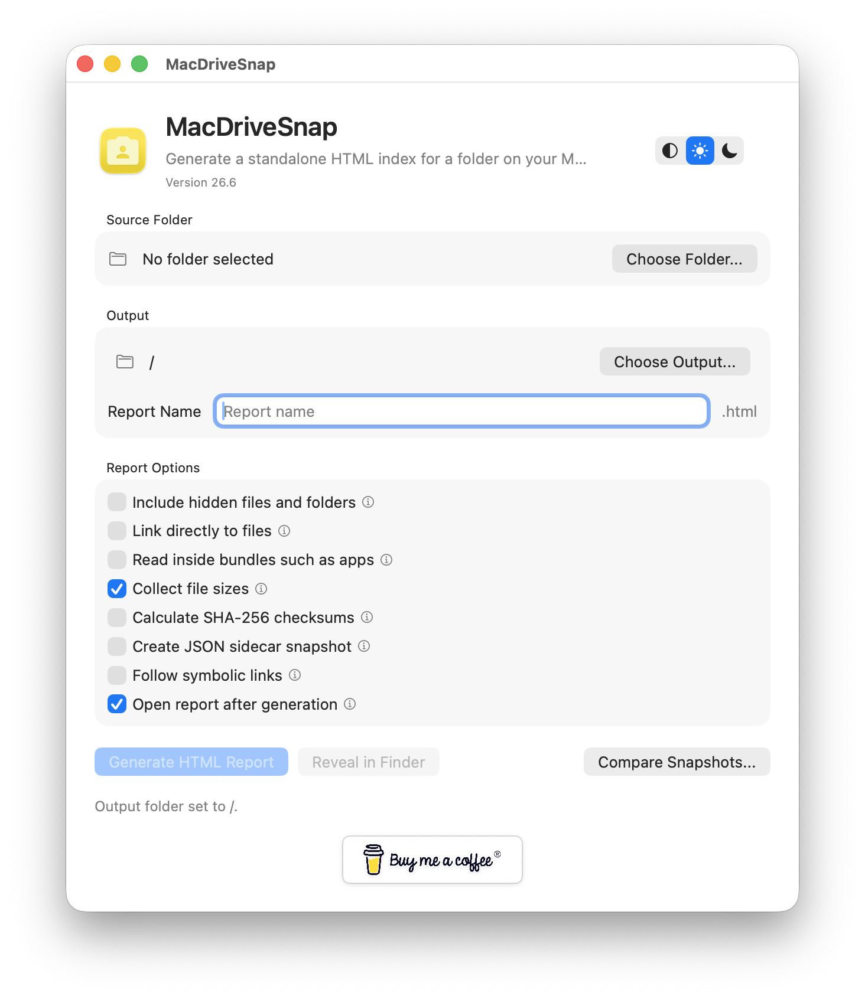
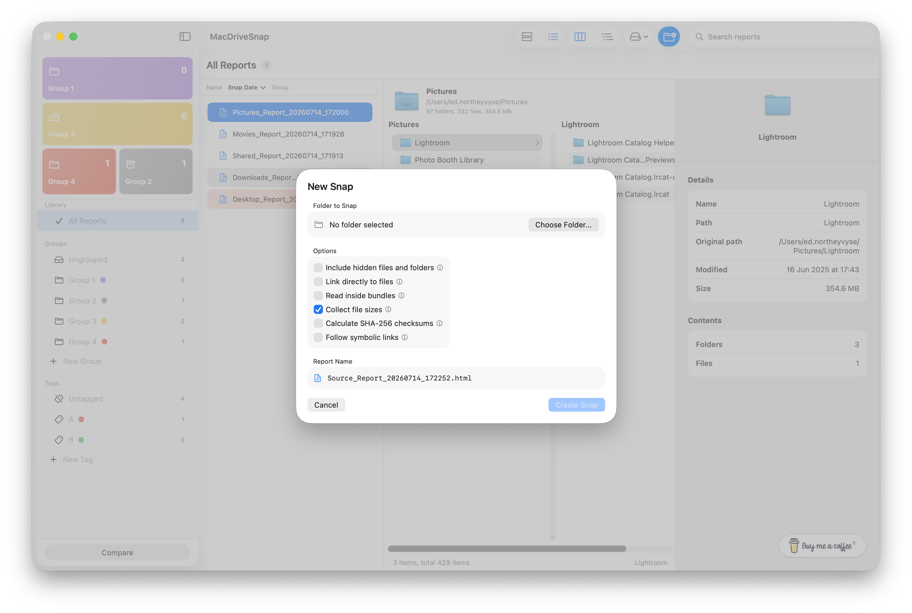
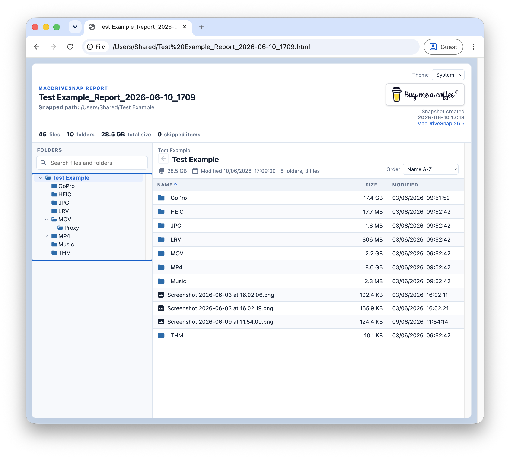

# MacDriveSnap

MacDriveSnap is a native macOS application for cataloguing drives and folders, then creating portable snapshots that can be exported as searchable HTML reports or structured JSON, CSV and XML files.

<<<<<<< HEAD
Designed for IT professionals, media production, photographers, archivists, and anyone managing large collections of files, MacDriveSnap lets you build a searchable catalogue of your storage while producing portable reports that can be shared, archived or viewed anywhere without copying the original files.

Whether you are documenting an external drive, verifying a backup, handing over a project, or creating a long-term archive, MacDriveSnap provides a fast and reliable way to record exactly what was on a drive at a specific point in time.

**Current Version:** **26.7.2**
=======
Designed for IT professionals, media production, photographers, archivists, and anyone managing large collections of files, MacDriveSnap lets you build a searchable catalogue of your storage while producing portable reports that can be shared, archived or viewed anywhere—without copying the original files.

Whether you're documenting an external drive, verifying a backup, handing over a project, or creating a long-term archive, MacDriveSnap provides a fast and reliable way to record exactly what was on a drive at a specific point in time.

**Current Version:** **26.7.1**
>>>>>>> f6254d1bed48cf0f9e4fb48ce9fc387e3186a531

---

# Download

Download the latest release:

https://github.com/ednortheyvyse/MacDriveSnap/releases/latest

Open `MacDriveSnap.dmg` and drag **MacDriveSnap.app** into your Applications folder.

<<<<<<< HEAD
MacDriveSnap supports automatic updates using **Sparkle**, allowing you to install new releases directly from **Check for Updates...** within the app.
=======
MacDriveSnap supports automatic updates using **Sparkle**, allowing you to install new releases directly from **Check for Updates…** within the app.
>>>>>>> f6254d1bed48cf0f9e4fb48ce9fc387e3186a531

---

# Why MacDriveSnap?

Most disk cataloguing applications keep your catalogue locked inside their own database.

<<<<<<< HEAD
MacDriveSnap goes further by combining a powerful catalogue manager with portable exports that anyone can open, search and use without needing MacDriveSnap installed.
=======
MacDriveSnap goes further by combining a powerful catalogue manager with portable exports that anyone can open, search and use—without needing MacDriveSnap installed.
>>>>>>> f6254d1bed48cf0f9e4fb48ce9fc387e3186a531

Use the built-in catalogue to organise snapshots, then export them for clients, colleagues, project archives or long-term storage.

---

# Features

## Catalogue Management

Keep all your snapshots organised in one place.

- Organise snapshots into groups
- Tag snapshots for easy searching
- Pin favourite groups
- Custom colours and icons
- Drag and drop snapshots between groups and tags
- Search across your catalogue
- Store snapshots locally without requiring the original drive
<<<<<<< HEAD
- Choose a shared catalogue location on local, external, or network storage
- Move an existing local catalogue to a shared location
- See which Mac generated each snapshot
=======
>>>>>>> f6254d1bed48cf0f9e4fb48ce9fc387e3186a531

---

## Snapshot Creation

Create a complete snapshot of any folder or drive.

- Drag folders directly from Finder
- Scan local, external and network storage
- Optional hidden file support
- Optional application bundle traversal
- Record:
  - File names
  - Folder structure
  - File sizes
  - Modified dates
<<<<<<< HEAD
  - Source Mac name
=======
>>>>>>> f6254d1bed48cf0f9e4fb48ce9fc387e3186a531
- Optional SHA-256 checksum generation
- Optional direct file links (macOS)

---

## Export Formats

Export snapshots in the format that best suits your workflow.

### HTML

Portable, searchable reports that can be viewed in any modern web browser.

Features include:

- Instant text search
- Finder-style folder navigation
- Expand/collapse folders
- Resizable folder tree
- Sort by:
  - Name
  - Size
  - Modified Date
- No software installation required
- Works on macOS, Windows and Linux

### JSON

Ideal for:

- Automation
- Custom integrations
- Scripting
- Data processing

### CSV

Perfect for:

- Microsoft Excel
- Apple Numbers
- Google Sheets
- Reporting and analysis

### XML

Useful for:

- Data interchange
- Long-term archival workflows
- Integration with third-party software

---

## Snapshot Comparison

Compare two snapshots to quickly identify differences.

Ideal for:

- Backup verification
- Archive auditing
- Drive migrations
- Project deliveries
- File change tracking

Quickly identify:

- Added files
- Removed files
- Modified files

---

## Privacy First

Everything is processed locally on your Mac.

MacDriveSnap:

- Does not upload your file lists
- Does not require an online account
- Does not use cloud processing
- Keeps your data entirely under your control

---

# Typical Uses

MacDriveSnap is useful wherever you need a permanent record of a drive or folder.

Common use cases include:

<<<<<<< HEAD
- TV and film productions
=======
- TV & film productions
>>>>>>> f6254d1bed48cf0f9e4fb48ce9fc387e3186a531
- Digital Imaging Technician (DIT) workflows
- Client drive handovers
- External drive cataloguing
- Backup verification
- LTO archive indexing
- Digital asset management
- Photography and video archives
- IT asset documentation
- Long-term project archiving
- Software development repositories
- Research and legal evidence archives

---

# Screenshots

## Catalogue

---

## Create a Snapshot

---

## Compare Snapshots

---

## Portable HTML Report

---

# System Requirements

- macOS 14.6 or later
- Apple Silicon or Intel Mac

---

# Privacy

Generated snapshots may include:

- File and folder names
- Folder paths
- File sizes
- Modified dates
- Direct file links (optional)
- SHA-256 checksums (optional)
<<<<<<< HEAD
- The Mac name that generated the snapshot
=======
>>>>>>> f6254d1bed48cf0f9e4fb48ce9fc387e3186a531

Review exported snapshots before sharing them outside your organisation.

---

# Similar Projects

MacDriveSnap occupies a similar space to these excellent directory snapshot tools:

<<<<<<< HEAD
- LinuxDir2HTML - https://github.com/homeisfar/LinuxDir2HTML
- Snap2HTML - https://www.rlvision.com/snap2html/
- DiskCatalogMaker - https://diskcatalogmaker.com/
=======
- LinuxDir2HTML — https://github.com/homeisfar/LinuxDir2HTML
- Snap2HTML — https://www.rlvision.com/snap2html/
- DiskCatalogMaker — https://diskcatalogmaker.com/
>>>>>>> f6254d1bed48cf0f9e4fb48ce9fc387e3186a531

---

# Roadmap

Future development will continue to focus on improving catalogue management, reporting, search capabilities and workflow features.

Feature suggestions and feedback are always welcome through GitHub Issues.

---

# Support Development

If MacDriveSnap saves you time, consider supporting its development:

https://buymeacoffee.com/ednortheyvyse

---

# License

<<<<<<< HEAD
Copyright (c) Ed Northey-Vyse.
=======
Copyright © Ed Northey-Vyse.
>>>>>>> f6254d1bed48cf0f9e4fb48ce9fc387e3186a531

See the repository for licensing information.
